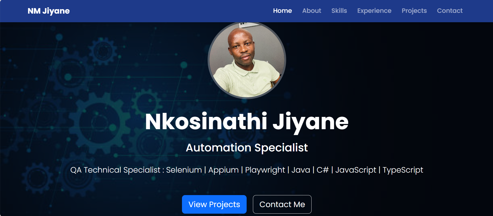

<h3><ins>Personal Profile of Nkosinathi M Jiyane</h3>

This is a simple website defining my personal profile such as working experience and tools.
Soon! I will host this simple website so it can be accessed through internet.

<h3><ins>How to view-run on your local machine - Tools used below :</h3>

- Visual studio code. You can use any IDE of your choice.
- On VS Code I used a plugin called : Live server to run on local machine.
- HTML :  Standard markup language.
- Java script : Programming language used to make web pages interactive and dynamic.
- CSS : Style sheet language - eg colors.
- Bootstrap : Design front-end framework  eg - responsive.
- Git : version controling tool. eg - push, pull your changes from/ to your repository.

<h2><ins>Output</h2>

<h3><ins>Thank you for your time to view my Profile : Happy coding ++</h3>